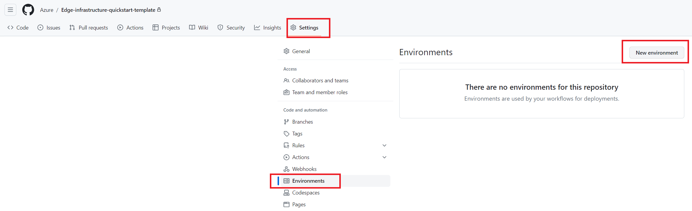
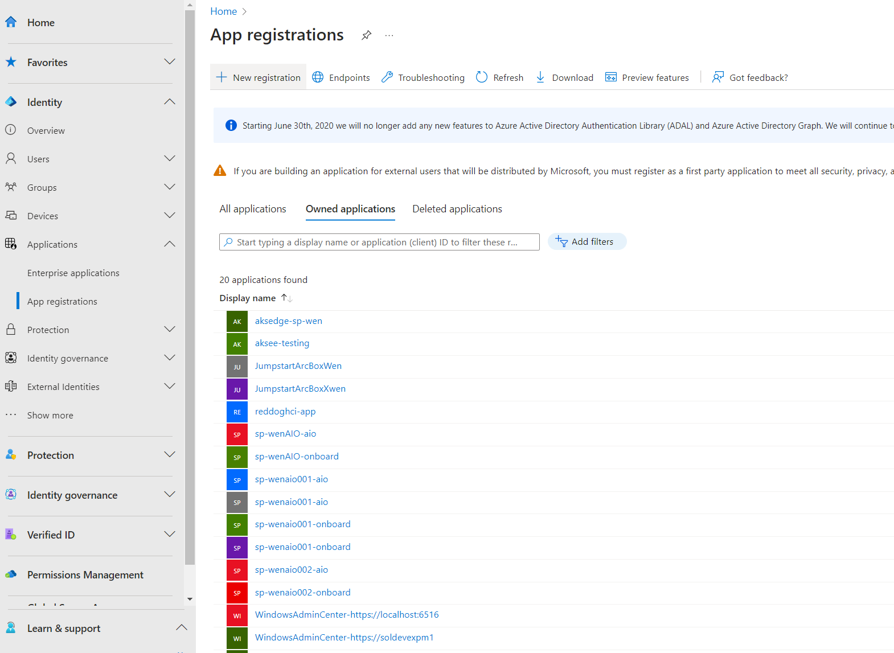
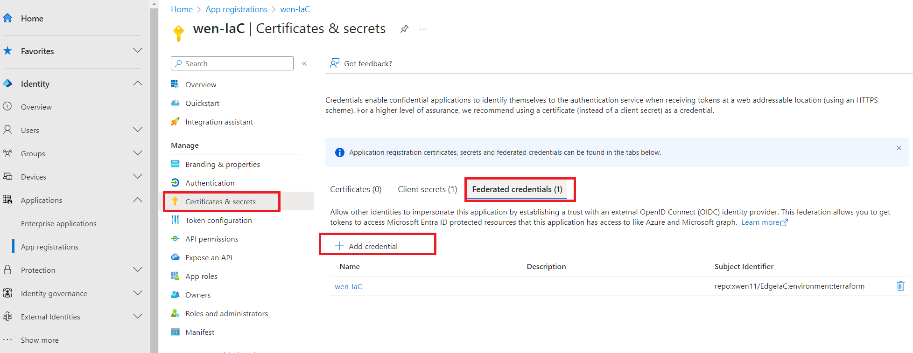
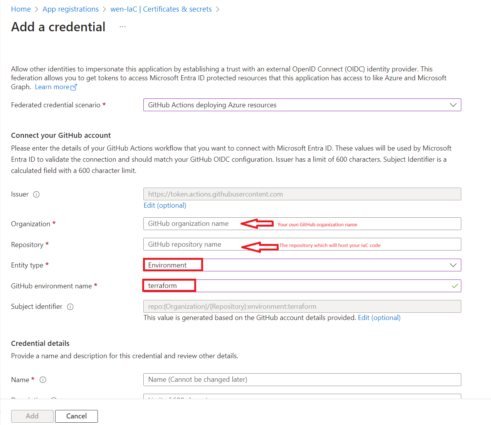
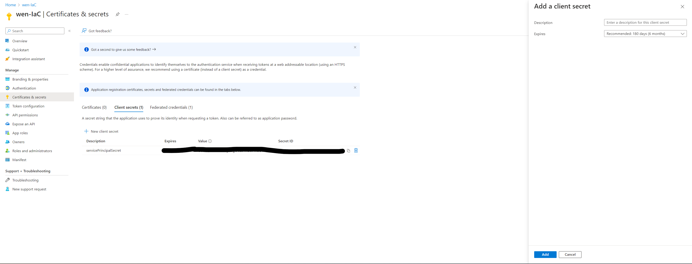
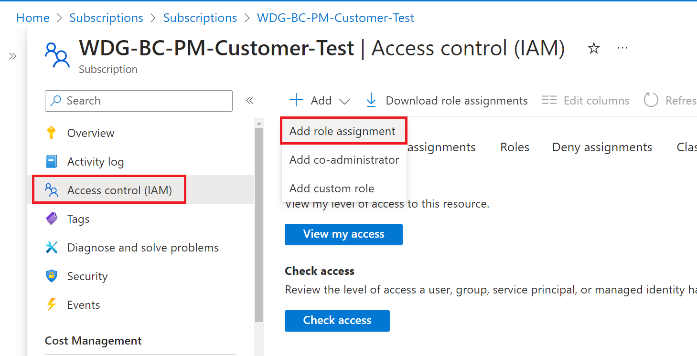
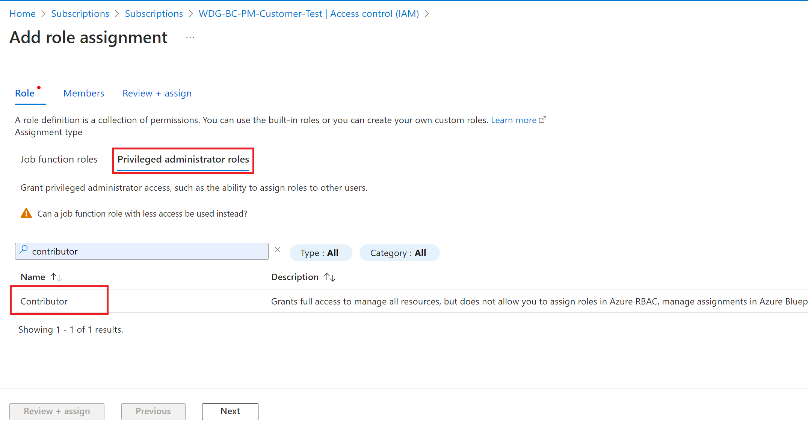
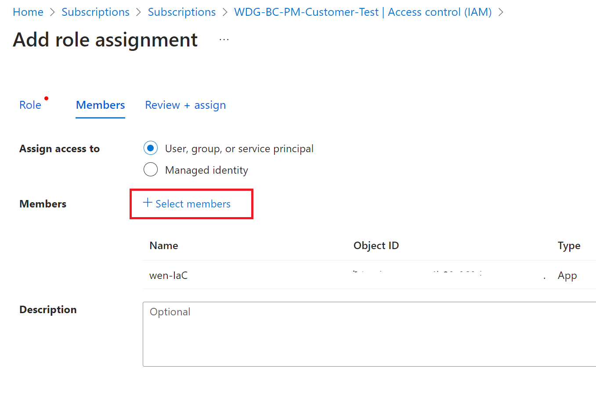
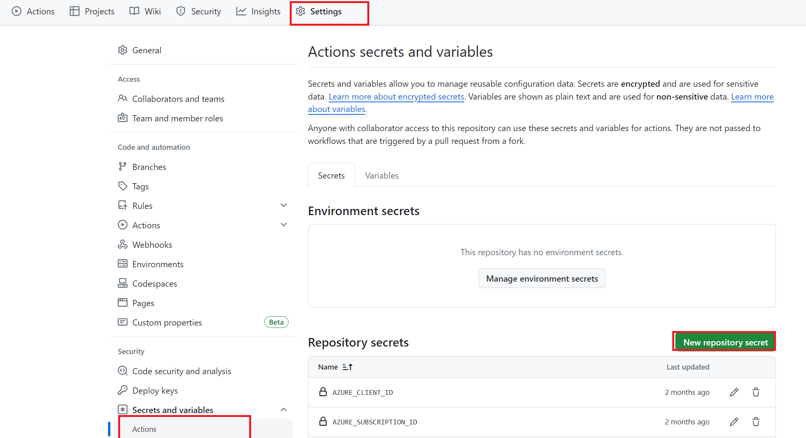
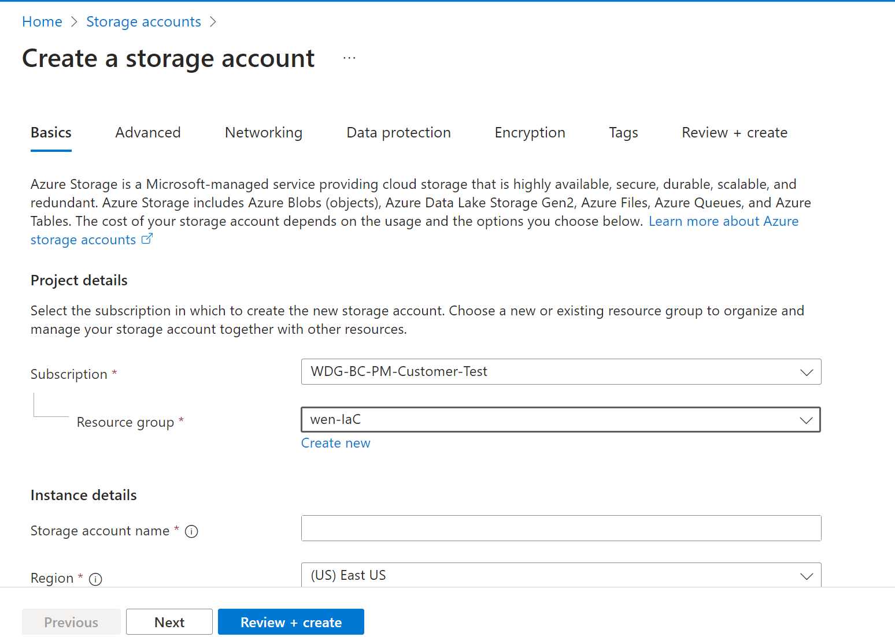

## Introduction
  
Edge Infrastructure Quickstart template (Preview) will provide you a unified and simple solution to set up your first edge location and then scale to multiple ones in the future. You can use this static template to build your edge fleet from scratch. 

**What you will build**
- A CI/CD pipeline containing Dev, QA, Prod three stages for DevOps
- HCI clusters deployed in physical or virtual environment

**Supported edge resources** (By March 2024)
- HCI23H2
- AKS hybrid
- Arc extensions

## Prerequisites
Before you get started, here are the steps you need to perform for prerequisites:

- Check deployment checklist and install AzureStack HCI OS on your servers to be deployed as AzureStack HCI clusters
- Complete the step 2 (Download the software) & 3 (Install the OS) in this [doc](https://learn.microsoft.com/en-us/azure-stack/hci/deploy/download-azure-stack-hci-23h2-software). 

<mark>Step 1 (Prepare Active Directory) & 4 (Register with Arc and set up permissions) are covered in the project.</mark>

## Getting Started

### Create a repository based on this template ###


### Connect GitHub Actions and Azure ###
1. **Setup [OIDC service principle](https://docs.github.com/en/actions/deployment/security-hardening-your-deployments/configuring-openid-connect-in-azure)**

&nbsp; &nbsp; &nbsp; &nbsp; Create `terraform` environment in your GitHub repository



Go to [Microsoft Entra Admin Center](https://entra.microsoft.com/#home) to create a service principal. Click **Applications** in the menu bar and then click **App Registrations** to list all the available service princpals. Create a new one for IaC



Add **Federated credential** to the service principal. 



Select `Environment` as entity type and input `terraform` to `Based on selection` input box



Add a **secret** into the service principal, then, save it to `servicePrincipalSecret`. We will need it in your IaC repository.



2. **Grant permissions for the service principal**

&nbsp; &nbsp; &nbsp; &nbsp;  grant the following permissions
      - Contributor (to create resource group / KeyVault / HCI cluster...)
      - Key Vault Secrets Officer (to create secret in azure KeyVault)
      - User Access Administrator (to grant role for arc-enabled servers)

&nbsp; &nbsp; &nbsp; &nbsp; Go back to your Azure subscription page in Azure portal, select **IAM** -> **Add Role Assignment**, then grant the permissions as follows







3. **Setup GitHub repo secrets**

&nbsp; &nbsp; &nbsp; &nbsp; Go to your GitHub repository, click repository **Settings** , then go to **Secrets and variables**, select **Actions** to create **New repository secret**



Set up the following secrets：

    - Pipeline secrets:
        * AZURE_CLIENT_ID: The client ID of the service principle in step 1.
        * AZURE_SUBSCRIPTION_ID: The subscription ID of the service principle in step 1.
        * AZURE_TENANT_ID: The tenant ID of the service principle in step 1.
    - HCI secrets:
        * domainAdminUser: create a new user name 
        * domainAdminPassword: create new password
        * localAdminUser: username when you login to the local host
        * localAdminPassword: password you use to login into the local host
        * deploymentUserName
        * deploymentUserPassword
        * servicePrincipalId
        * servicePrincipalSecret 

### Setup Terraform backend
Create a storage account in your Azure subscription (the same subscription as AZURE_SUBSCRIPTION_ID). Create a container in it.



Open `.azure/backendTemplate.tf` in this repository. Replace `\<ResourceGroupName\>`, `\<StorageAccountName\>`, `\<StorageContainerName\>` to the storage account and container you just created. <br/>

Commit `.azure/backendTemplate.tf` by running `git commit` and the run `git push` to push the changes to the remote branch.

### Setup git hooks
 
    Run `git config --local core.hooksPath ./.azure/hooks/`.
    This hook will generate the pipeline definition `deploy-infra.yml` when you commit changes to this repository.

### Setup GitHub runners
    - If the remote PowerShell port(5985) of HCI is exposed to the Internet. Open `.github/workflows/site-cd-workflow.yml`. Modify `runs-on` section to
    ```yml
        runs-on: [ubuntu-latest]
        # runs-on: [self-hosted]
    ```
    - If your HCI nodes can be remote managed inside your CorpNet. You can [setup self-host runner](https://docs.github.com/en/actions/hosting-your-own-runners/managing-self-hosted-runners/adding-self-hosted-runners). Runner hosts must setup the following tools.
        1. Install [Git](https://git-scm.com/downloads). Add `Git` to path. Run `git --version` to validate.
        2. Add `<Git installation root>\usr\bin` to path. The default path is `C:\Program Files\Git\usr\bin`. 
        3. Install [Az CLI](https://learn.microsoft.com/en-us/cli/azure/install-azure-cli). Run `az --version` to validate installation.
        4. Follow the first answer in [PowerShell Remoting - stackoverflow](https://stackoverflow.com/questions/18113651/powershell-remoting-policy-does-not-allow-the-delegation-of-user-credentials), finish client side settings to allow remote PowerShell HCI servers from runners.
        5. [Register self-hosted runners](https://docs.github.com/en/actions/hosting-your-own-runners/managing-self-hosted-runners/adding-self-hosted-runners). Make sure that the runner process is running as Administrator.


### Setup Repository
1. Create a branch from `main`.
1. Rename `dev/sample` to `<your location>`. Edit the variables in the `dev/<your location>/main.tf` commit and push.
1. Create a pull request to `main`. After approval, changes will be applied automatically. After the successful deployment, following resources will be created:
    1. A resource group name `<site>-rg`
    1. A KeyVault named `<site>-kv`: Contains secrets that used for deploy
    1. Arc servers that make up the HCI cluster
    1. A storage account used for HCI cloud witness
    1. An HCI cluster name `<site>-cl`
    1. Arc Resource Bridge named `<site>-cl-arcbridge`
    1. Custom location of ARB named `<site>-customLocation`
    1. Two storage paths named `UserStorage1`, `UserStorage2`
1. Add new sites by copy and paste your first site folder to others. Commit and create a pull request for new sites. After the pull request is merged, new sites will be applied.

## Sample scenario: Add new sites
After the first HCI deployment succeeds, you may want to scale the deployment to more sites. You can simply copy and paste your first site folder. Edit `main.tf` for each newly copied sites to the site specific values. Commit and create a pull request for the changes. Deployment pipeline and backend settings will be set during the commit. Once the pull request is merged into `main` branch, pipeline will be triggered and deploy new sites accordingly. An example could be
```
├───dev
│   └───firstsite
│           main.tf
│           ...
│
├───prod
│   ├───prod1
│   │       main.tf
│   │       ...
│   │
│   ├───prod2
│   │       main.tf
│   │       ...
│   │
│   └───prod3
│           main.tf
│           ...
│
└───qa
    ├───qa1
    │       main.tf
    │       ...
    │
    └───qa2
            main.tf
            ...
```
## Advanced

### Repo Structure
```
PROJECT_ROOT
│
├───.azure
│   │   backendTemplate.tf              // Backend storage account config file
│   │
│   └───hooks
│           pre-commit                  // Git hook to generate deployment workflow and set backend
│
├───.github
│   └───workflows
│           site-cd-workflow.yml        // Steps to deploy a single site
│
├───dev                                 // The first stage to deploy
│   └───sample
│           backend.tf
│           main.tf                     // Main configuration file for the site
│           provider.tf
│           terraform.tf
│           variables.tf
│
├───modules
│   ├───base                            // Base module of all sites
│   │       main.tf
│   │       variables.tf
│   │
│   ├───hci                             // Module to manage HCI clusters
│   │
│   ├───hci-extensions                  // Module to manage HCI extensions
│   │
│   ├───hci-provisioners                // Module to connect servers to Arc
│   │
│   └───hci-vm                          // Module to manage HCI VMs
│
├───prod                                // prod stage sites are deployed after qa stage
│   │
│   └───prod1
│
└───qa                                  // qa stage sites are deployed after dev stage
    │
    └───qa1
```

### Edit Stages

You may create new folders to represent a stage. Put new sites under the folder. Then, open `.stages` file to add the stage into your deployment workflow. Commit the changes, the deployment pipeline will change accordingly.

### Use your naming conventions for resources

Edit `modules/base/naming.tf` for your naming conventions. The default naming for resources are

| Resource                               | Naming                       |
| -------------------------------------- | ---------------------------- |
| Resource group                         | `{siteId}-rg`                |
| Witness storage account                | `{siteId}wit`                |
| KeyVault                               | `{siteId}-kv`                |
| cluster                                | `{siteId}-cl`                |
| custom location                        | `{siteId}-customlocation`    |
| Log analytics workspace                | `{siteId}-workspace`         |
| Log analytics data collection endpoint | `{siteId}-dce`               |
| Log analytics data collection rule     | `AzureStackHCI-{siteId}-dcr` |

You may toggle whether to append random suffix for storage account and KeyVault by with `randomSuffix` local variable. If `randomSuffix` is set to true, it can avoid conflicts when storage account and KeyVault soft deletion is enabled. `randomSuffix` is a random integer from 10 to 99. The naming will changed to

| Resource                | Naming                       |
| ----------------------- | ---------------------------- |
| Resource group          | `{siteId}-rg`                |
| Witness storage account | `{siteId}wit{randomSuffix}`  |
| KeyVault                | `{siteId}-kv-{randomSuffix}` |

### Customize The Deployment  
  
You may edit `modules/base` to customize your deployment template for all sites. You may add default values for your sites in `modules/base/variables.tf`. For example, tenant name is likely to be the same for all sites. You can add a default value for `tenant` variable.
```hcl
variable "tenant" {
  type        = string
  description = "The tenant ID for the Azure account."
  default     = "<your tennat ID>"
}
```

### Manual Apply

If you want to deploy locally:
1. Create a repository base on this template.
1. Clone the forked repository to your local machine.  
1. Install [Terraform](https://learn.hashicorp.com/tutorials/terraform/install-cli) if not already installed.  
1. Make sure you have the following permissions to the subscription you want to deploy HCI clusters.
    - Contributor (to create resource group / KeyVault / HCI cluster...)
    - Key Vault Secrets Officer (to create secret in azure KeyVault)
    - User Access Administrator (to grant role for arc-enabled servers)
1. Edit `.azure/backendTemplate.tf` to use local backend.
    ```hcl
    terraform {
    backend "local" {}
    }
    ```
1. Modify the variables in the `dev/sample/main.tf` file to fit your environment's requirements.
1. Open a PowerShell as administrator, `az login` with your credentials.
1. Go to the site folder `cd dev/sample`.
1. Add `sample.tfvars` to assign values for variables.
    ```hcl
    subscriptionId         = "<your subscription id>"
    localAdminUser         = "<local admin user name>"
    localAdminPassword     = "<local admin password>"
    domainAdminUser        = "<domain admin user name>"
    domainAdminPassword    = "<domain admin user password>"
    deploymentUserName     = "<deployment user name>"
    deploymentUserPassword = "<deployment user password>"
    servicePrincipalId     = "<service principal id created in the first step of setting pipeline>"
    servicePrincipalSecret = "<service principal secret created in the first step of setting pipeline>"
    ```
2. Initialize the Terraform working directory by running `terraform init`.
3. Apply the Terraform configuration and create the resources by running `terraform apply -var-file="sample.tfvars"`.
  
The above commands will provision an AzureStack HCI cluster in your Azure subscription.

### Connect Arc servers by yourself
You can prepare AD and connect Arc servers by yourself according to [doc](https://learn.microsoft.com/en-us/azure-stack/hci/deploy/download-azure-stack-hci-23h2-software) step 1 & 4. After connecting servers, go to `<stage>/<your site>/imports.tf` and uncomment the import block, change the placeholders to your resource group that contains the Arc servers. Open `<stage>/<your site>/main.tf` and change `enableProvisioners = false`.

## Telemetry ##
Microsoft collects deployment pipeline telemetry. If you do not want to send telemetry, edit `.github/workflows/site-cd-workflow.yml`, remove all steps starts with `Telemetry`.

## Clean Up ##
Removing one folder will not remove the resources created by this folder previously.

You have 2 ways to cleanup if you do want to remove the resources.
- Before removing the folder, run `terraform destroy` to destroy the resources created by this Terraform configuration. Then remove this folder.
- Go to Azure portal or use CLI to remove `${siteId}-rg` resource group and remove this folder.

## License  
  
This project is licensed under the MIT License. See the [LICENSE](LICENSE) file for more information.  
  
## Disclaimer  
  
This repository is provided "as-is" without any warranties or support. Use at your own risk. Always test in a non-production environment before deploying to production.  

## Contributing

This project welcomes contributions and suggestions.  Most contributions require you to agree to a
Contributor License Agreement (CLA) declaring that you have the right to, and actually do, grant us
the rights to use your contribution. For details, visit https://cla.opensource.microsoft.com.

When you submit a pull request, a CLA bot will automatically determine whether you need to provide
a CLA and decorate the PR appropriately (e.g., status check, comment). Simply follow the instructions
provided by the bot. You will only need to do this once across all repos using our CLA.

This project has adopted the [Microsoft Open Source Code of Conduct](https://opensource.microsoft.com/codeofconduct/).
For more information see the [Code of Conduct FAQ](https://opensource.microsoft.com/codeofconduct/faq/) or
contact [opencode@microsoft.com](mailto:opencode@microsoft.com) with any additional questions or comments.

## Trademarks

This project may contain trademarks or logos for projects, products, or services. Authorized use of Microsoft 
trademarks or logos is subject to and must follow 
[Microsoft's Trademark & Brand Guidelines](https://www.microsoft.com/en-us/legal/intellectualproperty/trademarks/usage/general).
Use of Microsoft trademarks or logos in modified versions of this project must not cause confusion or imply Microsoft sponsorship.
Any use of third-party trademarks or logos are subject to those third-party's policies.
