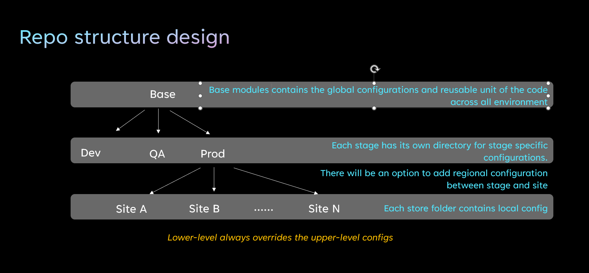
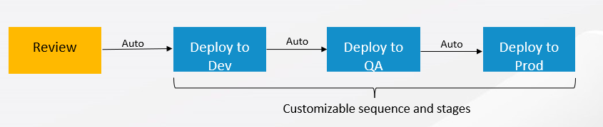
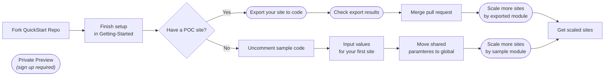
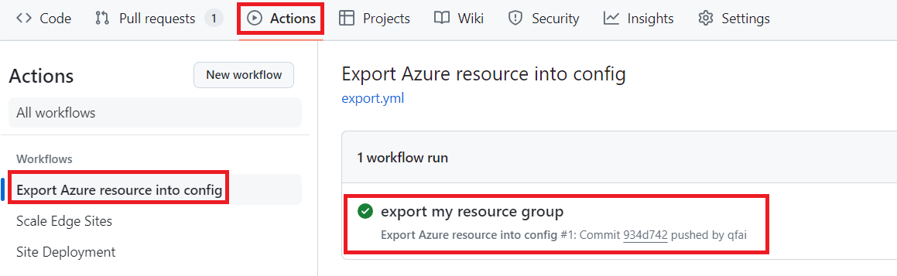
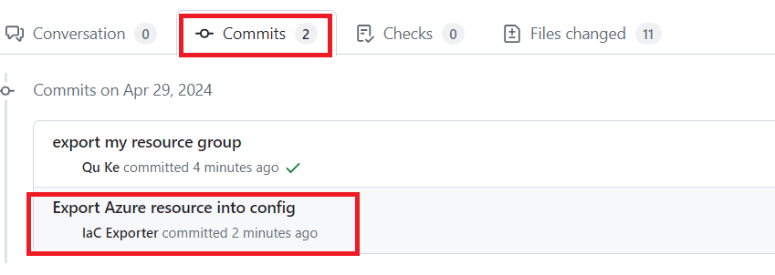

# Edge Infrastructure QuickStart Template For Scaling (Preview) 
  ----- Accelerate, Automate, and Simplify the IaC setup using your familiar tools
## Overview

This Quick-Start template simplifies your Infrastructure as Code journey with Azure edge products throughout their lifecycle. It includes a few Terraform modules (**AKS Arc**, **Azure Stack HCI**, **Arc Site Manager** and **Arc extensions**), a scalable hands-on repository structure and the automation tools to streamline the setup of the infrastructure configurations for production scaling.

### What You'll Get

By using this template, you can get all of the followings inside a single PR under your GitHub account

* a scalable and extendible repository structure following the DevOps best practice

    <details>

    <summary><b>Repo Structure</b></summary>

    

    ```PROJECT_ROOT
    │
    ├───.azure
    │   │   backendTemplate.tf              // Backend storage account config file
    │   │
    │   └───hooks
    │           pre-commit                  // Git hook to generate deployment workflow and set backend
    │
    ├───.github
    │   └───workflows
    │           site-cd-workflow.yml        // Set up CD pipeline
    |           terraform-plan.yml
    │
    ├───dev                                 // The first stage to deploy
    │   └───sample
    │           backend.tf
    │           main.tf                     // Main configuration file for the site
    │           provider.tf
    │           terraform.tf
    │           variables.tf
    │
    ├───modules
    │   ├───base                            // Base module of all sites
    │   │       main.tf
    │   │       variables.tf
    │   │
    │   ├───hci                             // Module to manage HCI clusters
    │   │
    │   ├───hci-extensions                  // Module to manage HCI extensions                                                                     
    │   ├───hci-provisioners                // Module to connect servers to Arc
    │   │───aks-arc                         // Module to manage AKS Arc clusters
    │   └───hci-vm                          // Module to manage HCI VMs
    │   └───site-manager                    // Module to manage site-manager
    │
    ├───prod                                // prod stage sites are deployed after qa stage
    │   │
    │   └───prod1
    │
    └───qa                                  // qa stage sites are deployed after dev stage
        │
        └───qa1
    ```

    Base module contains the global variables across all sites. Each stage and each site folder contains the local variables specific to the stage/site. Local settings can override the global settings.

    </details>

* organized variables with the prefilled values to boost your initial setup
    <details>

    <summary><b>Variables Structure</b></summary>

    | Variable Type           | Description                                                                                                     | Example             | Where to set value                                                                                       | Override Priority |
    | ----------------------- | --------------------------------------------------------------------------------------------------------------- | ------------------- | -------------------------------------------------------------------------------------------------------- | :---------------: |
    | Global Variables        | The values of the global variables typically are consistent across the whole fleet but specific for one product | `domainFqdn` in HCI | Set in `modules/base/<product>.hci.global.tf`. Add default value for variables.                          |        low        |
    | Site specific variables | The values of these variables are unique in each site                                                           | `siteId`            | These variables must be set in the site `main.tf` file under each site folder                            |       high        |
    | Pass through variables  | The values of these variables are inherited from GitHub secrets                                                 | `subscriptionId`    | `modules/base/<product>.hci.misc.tf`                                                                     |                   |
    | Reference variables     | These variables are shared by 2 or more products                                                                | `location`          | Its definition can be found in `variables.<product>.*.tf` if its link is `ref/<product>/<variable_name>` |                   |

    </details>

* a customizable CD pipeline with the automations.
    <details>

    <summary><b>CI/CD Pipeline</b></summary>

    

    </details>

### Is This Right for You?

**Yes** if you want to:

* Create an initial site containing AKS Arc, HCI23H2 along with Arc extensions using Terraform
* If you have manually created a PoC site and wish to convert the PoC site settings into Terraform code.
* Replicate the settings from the above site multiple times
* Integrate the above settings with CI/CD pipeline using GitHub Actions
* Automate all of the above scenarios

**No** if you want to:

* Create single AKS Arc or HCI instance using Terraform. Although this template contains the Terraform module for each of them, we are still waiting to officially publish them into public Terraform registry. You are welcome to use this repository for testing and exploration. For production usage, please contact arcIaCSupport@microsoft.com for each module's status.
* Use any other IaC tool such as Bicep or ARM to provision your Azure resources. We are working on our roadmap. Please stay tuned for future releases.

### Supported scenarios



### Supported Azure edge resource types

<details>

<summary><b> Supported Azure edge resource types</b></summary>

* [Azure Stack HCI, version 23H2](https://learn.microsoft.com/en-us/azure-stack/hci/whats-new)
* [Azure Stack HCI extensions](https://learn.microsoft.com/en-us/azure-stack/hci/manage/arc-extension-management?tabs=azureportal)
* [Azure Kubernetes Service (AKS) enabled by Azure Arc](https://learn.microsoft.com/en-us/azure/aks/hybrid/)
* [Arc Site Manager](https://review.learn.microsoft.com/en-us/azure/azure-arc/site-manager/overview?branch=release-preview-site-manager)
* [Azure resource group](https://learn.microsoft.com/en-us/azure/azure-resource-manager/management/overview)

</details>

## Getting started

This repository implements AD preparation and Arc connection. Follow the instructions below to set up the rest of the components.

**Steps**: [Getting-Started](./doc/Getting-Started.md)

## Scenario 1: Create your first site from scratch using quick-start template, then scale more sites

### Create your first site from scratch using quick-start template

**Overview**: Ready to deploy your first with AKS Arc on HCI23H2 along with Arc extensions? It's the right place for you.
This scenario provides a quick and efficient way to establish a new site with edge resources with a predefined infrastructure template.

**Steps**: [Create your first site](./doc/Add-first-Site.md)

**Expected outcome**:

* A PR containing Terraform code set up for AKS Arc, HCI, Arc extensions under a single resource group
* A PR containing a pre-defined CI/CD pipeline with the 3 stages: Dev, QA, Prod
* Provisioning action will happen in your side (*merge the PR to `main`*)

### Scale more sites (Private Preview)

**Overview**: Automatically configure scaling settings based on the parameters defined in the previous steps.

**Steps**:

* This feature is currently in **Private Preview**. Before you begin: [Sign up Private Preview](./doc/sign-up-Private-Preview.md)
* Confirm and update the global configurations: If you would like to update the pre-filled values of the global configurations, follow the guidance [Edit-Global-Parameters](./doc/Edit-Global-Parameters.md) to make the change.
* Get the scaling code based on the quick-start template:
    1. Create a new branch from `main` by running `git checkout -b <yourFeatureBranch>`
    2. Run `./az-edge-site-scale generate -c ./.azure/scale.csv -s ./dev/<yourSiteName>` to get the scaling csv file. You can find a spread sheet under `./.azure`. The spread sheet contains all the entries which need customized inputs from you per site.
* [Scale with the automations](./doc/Scale-with-automation.md)

**Expected outcome**:

* A PR with the Terraform code for # of sites, each containing 1 HCI cluster, 1 AKS Arc cluster and the optional monitoring extension and Arc site manager extension.
* A PR containing a pre-defined CI/CD pipeline with the 3 stages: Dev, QA, Prod
* Provisioning action will happen in your side (*merge the PR to `main`*)

## Scenario 2: Convert your PoC site settings into IaC code, then scale (Private Preview)

**Overview**: If you already have a PoC Site modeled within a resource group. This scenario will codify the existing resources and translate them into Terraform modules, then using automations to replicate the custom templates for multiple sites.

**Steps**:

* This feature is currently in **Private Preview**. Before you begin: [Sign up Private Preview](./doc/sign-up-Private-Preview.md)
 > [!IMPORTANT]
 > Resources under the resource group must belong to one single site. Code generation **doesn't** support resource groups containing multiple HCI clusters for now.
* Convert the PoC site into IaC code:

    1. Create a branch from `main` branch by running `git checkout -b <yourFeatureBranch>`
    2. Add a new file `.azure/export.json`. Do not use `base` as the name of the module. It may carry the original contents in your exported module.

    ```json
    [
        {
            "resourceGroup": "/subscriptions/<your-subscription-id>/resourceGroups/<yourSampleResourceGroup>",
            "baseModulePath": "./modules/<name-of-the-module>",
            "groupPath": "./dev/<yourSiteName>"
        }
    ]
    ```

    3. Commit and push `.azure/export.json`: `git commit -m <commit message>` and `git push -u origin <yourFeatureBranch>`. A GitHub workflow will be triggered automatically. Create a pull request to `main`.You can find your workflow run as following.
    
    
    
    4. After workflow execution, check the generated code.
    
    

    * If the workflow runs successfully, the generated code is identical to Azure resources. Please merge the branch ASAP. If there are changes happened after export, the changes will be reverted.
    * If the workflow run fails, you can check `./dev/<yourSiteName>/export-diff` to see what are the changes.

* [Scale with automations](./doc/Scale-with-automation.md)

**Expected outcome**:

* A GitHub repository with Terraform code for # of sites, each containing custom settings for HCI clusters, AKS Arc clusters
* A pre-defined CI/CD pipeline containing 3 stages: Dev, QA, Prod
* Provisioning action will happen in your side (*merge the PR to `main`*)

## Enable Arc extensions for all sites

Any change merged into `main` branch will trigger the update pipeline. If the change fails in early stages, the deployment will be blocked so that this failure will not affect the production sites.

Following tutorials help you to turn on opt-in features:

* [Add HCI Insights](./doc/Add-HCI-Insights.md)
* [Add New Sites with Arc Site Manager](./doc/Add-Site-Manager.md)
* [Add HCI VM by Marketplace Windows Server Image](./doc/Add-HCI-VM.md)

## Advanced topics

- [Customize Stages](./doc/Customize-Stages.md)
- [Update global parameters](./doc/Edit-Global-Parameters.md)
- [Disable Telemetry](./doc/Disable-Telemetry.md)
- [Untrack Resources from The Repository](./doc/Untrack-Resources.md)
- [View your CI/CD pipeline running status](./doc/View-pipeline.md)
- [TroubleShoot](./doc/TroubleShooting.md)

## Ask for support

[Open issue](https://github.com/Azure/Edge-infrastructure-quickstart-template/issues/new) or contact arcIaCSupport@microsoft.com for any issue or support

## License  
  
This project is licensed under the MIT License. See the [LICENSE](LICENSE) file for more information.  
  
## Disclaimer  

'Preview Terms'. This repository (the "Preview") is subject to the [Supplemental Terms of Use for Microsoft Azure Previews](https://azure.microsoft.com/en-us/support/legal/preview-supplemental-terms/). Unless otherwise noted, Customer should not use the Preview to process Personal Data or other Data that is subject to legal or regulatory compliance requirements.

'Confidentiality'.The Preview and any associated materials or documentation are confidential information and subject to obligations in your Non-Disclosure Agreement with Microsoft.

This repository is provided "as-is" without any warranties or support. Use at your own risk. Always test in a non-production environment before deploying to production.  

## Contributing

This project welcomes contributions and suggestions.  Most contributions require you to agree to a
Contributor License Agreement (CLA) declaring that you have the right to, and actually do, grant us
the rights to use your contribution. For details, visit [Microsoft opensource](https://cla.opensource.microsoft.com).

When you submit a pull request, a CLA bot will automatically determine whether you need to provide
a CLA and decorate the PR appropriately (e.g., status check, comment). Simply follow the instructions
provided by the bot. You will only need to do this once across all repos using our CLA.

This project has adopted the [Microsoft Open Source Code of Conduct](https://opensource.microsoft.com/codeofconduct/).
For more information see the [Code of Conduct FAQ](https://opensource.microsoft.com/codeofconduct/faq/) or
contact [opencode@microsoft.com](mailto:opencode@microsoft.com) with any additional questions or comments.

## Trademarks

This project may contain trademarks or logos for projects, products, or services. Authorized use of Microsoft
trademarks or logos is subject to and must follow
[Microsoft's Trademark & Brand Guidelines](https://www.microsoft.com/en-us/legal/intellectualproperty/trademarks/usage/general).
Use of Microsoft trademarks or logos in modified versions of this project must not cause confusion or imply Microsoft sponsorship.
Any use of third-party trademarks or logos are subject to those third-party's policies.
