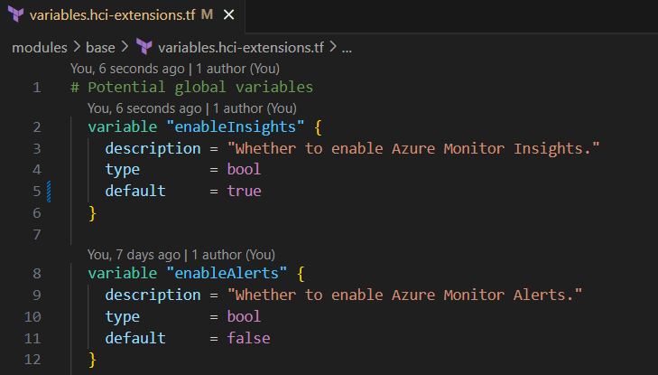

# Add HCI Insights

Go to `modules/base/variables.hci-extensions.tf`. Change default value of `enableInsights` from `false` to `true.`

Do the same to enable alerts by toggling the default value of `enableAlerts` for HCI.
