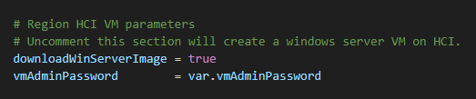
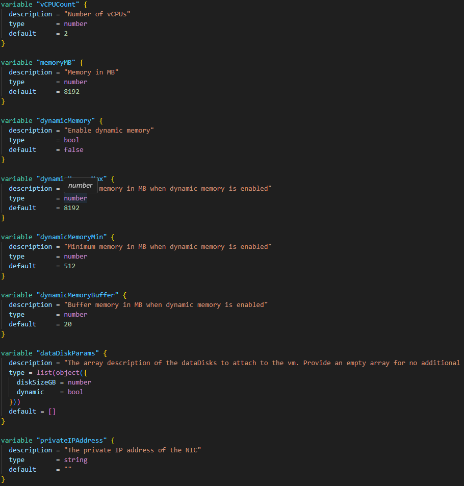

# Create a VM with Marketplace Windows Server Image

## Add secret for VM admin password

Add a secret named `vmAdminPassword` to your repo secrets. Follow [Setup GitHub repo secrets](./Connect-Azure-Portal.md#setup-github-repo-secrets) for details.

## Add the VM

Uncomment the HCI VM section in the `main.tf` in your first site to add a VM with marketplace Windows server image.



## Set VM size

Go to `modules/base/variables.hci-vm.global.tf`. You may change the default values for CPU count and memory size by changing the default values.



## Change VM name

Go to `modules/base/naming.tf`, change the following line to meet your naming conventions.

The VM name should be 1-15 characters which contains only alphanumeric characters and hyphens.

```
  vmName                     = "${var.siteId}-vm"
```

## Join the VM to your domain

1. Go to `modules/base/variables.hci-vm.global.tf`. Input `domainToJoin` and `domainTargetOu` of your organization.
2. Change the `domainJoinUsername` in `modules/base/naming.tf`.
3. Add `domainJoinPassword` to the repo secrets.
