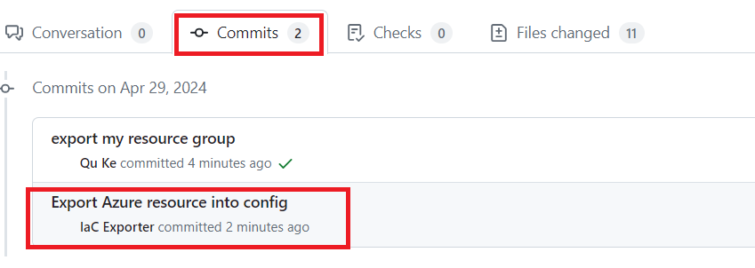

# Add New Sites with the automations

## Step 1: Create a custom base module from an existing Azure resource group

1. Create a branch from `main` branch by running `git checkout -b <yourFeatureBranch>`
2. Add a new file `.azure/export.json`. Do not use `base` as the name of the module. It may carry the original contents in your exported module.

    ```json
    [
        {
            "resourceGroup": "/subscriptions/<your-subscription-id>/resourceGroups/<yourSampleResourceGroup>",
            "baseModulePath": "./modules/<name-of-the-module>",
            "groupPath": "./dev/<yourSiteName>"
        }
    ]
    ```

3. Commit and push `.azure/export.json`: `git commit -m <commit message>` and `git push -u origin <yourFeatureBranch>`. A GitHub workflow will be triggered automatically. Create a pull request to `main`.You can find your workflow run as following.

4. After workflow execution, check the generated code.

   - If the workflow runs successfully, the generated code is identical to Azure resources. Please merge the branch ASAP. If there are changes happened after export, the changes will be reverted.
   - If the workflow run fails, you can check `./dev/<yourSiteName>/export-diff` to see what are the changes.

## Step 2: Setting up the scaling configurations through IaC automation

1. You can find a spread sheet under `./.azure/scale/` after Step 2. The spread sheet contains all the entries which need customized inputs from you per site.
2. Create a new branch from `main` by running `git checkout -b <yourFeatureBranch>`
3. Copy `./.azure/scale/<module-name>.csv` to `./.azure/scale.csv`.
4. Open the CSV file by Excel. Input new values according to the first line.
5. Commit `git commit -m <commit message>`and then push the CSV `git push -u origin <yourFeatureBranch>` to the remote feature branch. The pre-commit hook will add new sites to the deployment workflow automatically.
6. After pushing to the remote branch, new scaling configurations in Terraform format will be automatically generated through our automation workflow. Create a pull request to `main`. You can view the workflow execution in action panel.


6. After the workflow execution finished, you can check the files changed by the automation workflow. If all jobs complete successfully, you can merge the branch to `main`.


## Next Step

[Go back to home page](../README.md)

Learn more:

- About [scale sites](./Add-New-Sites-with-static.md)
- About [view your CI/CD pipeline running status](./View-pipeline.md)
- About [troubleShoot](./TroubleShooting.md)
- About [enable arc extensions for all sites](../README.md#enable-arc-extensions-for-all-sites)
