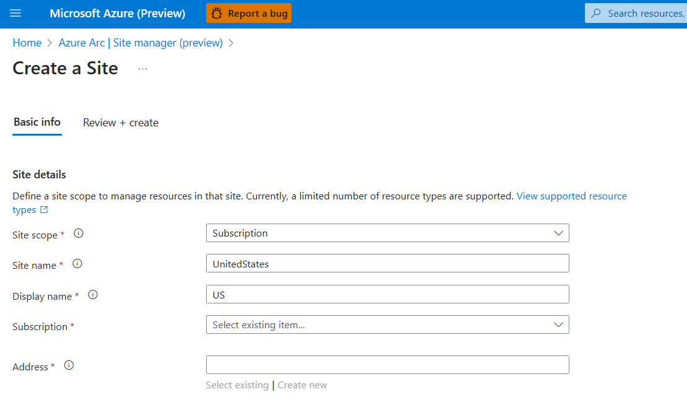
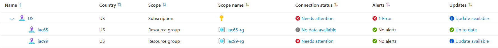

# Add Site Manager
## Add regional status view
Go to [https://aka.ms/site](https://aka.ms/site). Click `Create site` button. Select subscription level and input the information for this subscription. For example, if the subscription contains all sites in the united states, you may create a site as follows.


## Add site status view
You may add your site information in the `main.tf` in the site folder. Country information is required. Other fields are optional. If you don't want to specify those details, you may remove that line.

```
module "base" {
  ...

  country         = "<country>"
  city            = "<city>"
  companyName     = "<companyName>"
  postalCode      = "<postalCode>"
  stateOrProvince = "<stateOrProvince>"
  streetAddress1  = "<streetAddress1>"
  streetAddress2  = "<streetAddress2>"
  streetAddress3  = "<streetAddress3>"
  zipExtendedCode = "<zipExtendedCode>"
  contactName     = "<contactName>"
  emailList       = ["<emailList>"]
  mobile          = "<mobile>"
  phone           = "<phone>"
  phoneExtension  = "<phoneExtension>"
}
```

After this change is applied, you can go to [https://aka.ms/site](https://aka.ms/site) to view your site health status.

