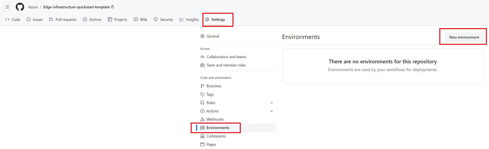
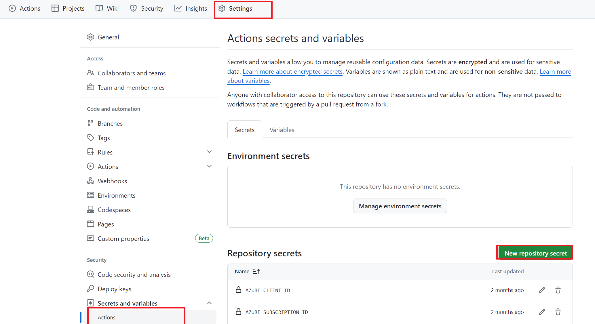

# Connect GitHub Actions and Azure Use Azure CLI
This doc is using Azure CLI to do the job, if you want to use Azure portal, see [Connect Azure using Portal](./Connect-Azure-Portal.md).
## Prerequisite

Ensure that you can create service principals in your tenant and you have the permission to assign roles.

## Setup [OIDC service principal](https://docs.github.com/en/actions/deployment/security-hardening-your-deployments/configuring-openid-connect-in-azure)

Create `terraform` environment in your GitHub repository



the following script will do:
1. Create a new service principle
2. Setup federation credential for the github repo
3. Grant Contributor/Key vault secrets officer/user access administrator to the service principal
   
> [!NOTE]
> If you are reusing a existing service principal, this guide might not suit you because it will reset the service principal secret. try [Connect Azure using Portal](./Connect-Azure-Portal.md).

Replace '\<yourServicePrincipleName>' with the service principle name you want to create, replace '\<yourSubscription>' with the subscription you want to create hci, replace '\<orignizationName>/\<repoName>' with the orignization and name of your GitHub repo. Run following script in powershell.

```
az login
$spName="<yourServicePrincipleName>" #Replace it!
$yoursubscription="<yourSubscription>" #Replace it!
$yourreponame="<orignizationName>/<repoName>" #Replace it!

az account set --subscription $yoursubscription

az ad sp create-for-rbac --name $spName

$spid = az ad sp list --display-name $spName --query "[0].appId" -o tsv
$reponamewithoutslash = $yourreponame -replace "/", "_"
$jsonContent = @"
{
    "name": "${reponamewithoutslash}_environment_terraform",
    "issuer": "https://token.actions.githubusercontent.com",
    "subject": "repo:${yourreponame}:environment:terraform",
    "description": "service principal for terraform environment for repo $yourreponame",
    "audiences": [
        "api://AzureADTokenExchange"
    ]
}
"@
Set-Content $jsonContent -Path "$env:TEMP/terraformenv.json"
az ad app federated-credential create --id $spid --parameters "$env:TEMP/terraformenv.json"
$jsonContent = @"
{
    "name": "repo_${reponamewithoutslash}_pull_request",
    "issuer": "https://token.actions.githubusercontent.com",
    "subject": "repo:${yourreponame}:pull_request",
    "description": "service principal for pull request for repo $yourreponame",
    "audiences": [
        "api://AzureADTokenExchange"
    ]
}
"@
Set-Content $jsonContent -Path "$env:TEMP/pullrequest.json"
az ad app federated-credential create --id $spid --parameters "$env:TEMP/pullrequest.json"

$pass = az ad app credential reset --id $spid

echo "grant permission Contributor/Key vault secrets officer/user access administrator to the service principal $spName"
az role assignment create --role "Contributor" --assignee $spid --scope "/subscriptions/$yoursubscription"
az role assignment create --role "Key vault secrets officer" --assignee $spid --scope "/subscriptions/$yoursubscription"
az role assignment create --role "User Access Administrator" --assignee $spid --scope "/subscriptions/$yoursubscription"

$rpid=az ad sp list --filter "appid eq '1412d89f-b8a8-4111-b4fd-e82905cbd85d'" --query "[0].id"

echo "set sp related secret with"
echo $pass
$password = $pass | ConvertFrom-Json | Select-Object -ExpandProperty "password"
echo "set repository secret rpServicePrincipalObjectId with $rpid"
echo "set repository secret servicePrincipalSecret with $password"

```
## Setup GitHub repo secrets

Go to your GitHub repository, click repository **Settings** , then go to **Secrets and variables**, select **Actions** to create **New repository secret**

Set up the following secrets：

1. Pipeline secrets:

    - AZURE_CLIENT_ID: The client ID of the service principal in step 1.
    - AZURE_SUBSCRIPTION_ID: The subscription ID of the service principal in step 1.
    - AZURE_TENANT_ID: The tenant ID of the service principal in step 1.

2. HCI secrets:

    - domainAdminUser: The admin user name of domain controller. (Leave it empty if you prepare AD yourself)
    - domainAdminPassword: The admin user password of domain controller. (Leave it empty if you prepare AD yourself)
    - localAdminUser: The admin user name of HCI hosts.
    - localAdminPassword: The admin user password of HCI hosts.
    - deploymentUserPassword: The password of deployment user which will be created during HCI deployment.
    - servicePrincipalId: The **client** ID of the service principal for Arc Resource Bridge deployment. (Can be the same as AZURE_CLIENT_ID)
    - servicePrincipalSecret (the script will echo the value)
    - rpServicePrincipalObjectId (the script will echo the value)




---
Next Step: [Configure Local Git](./Configure-Local-Git.md)