# Connect GitHub Actions and Azure Use Portal
This doc is using Azure portal to do the job, if you want to use Azure CLI, see [Connect Azure using Azure CLI](./Connect-Azure-Script.md).
## Prerequisite

Ensure that you can create service principals in your tenant and you have the permission to assign roles.

## Setup [OIDC service principal](https://docs.github.com/en/actions/deployment/security-hardening-your-deployments/configuring-openid-connect-in-azure)

Create `terraform` environment in your GitHub repository

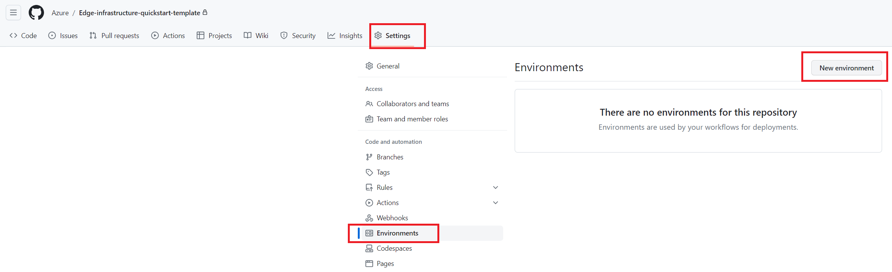

Go to [Microsoft Entra Admin Center](https://entra.microsoft.com/#home) to create a service principal. Click **Applications** in the menu bar and then click **App Registrations** to list all the available service principals. Create a new one for IaC

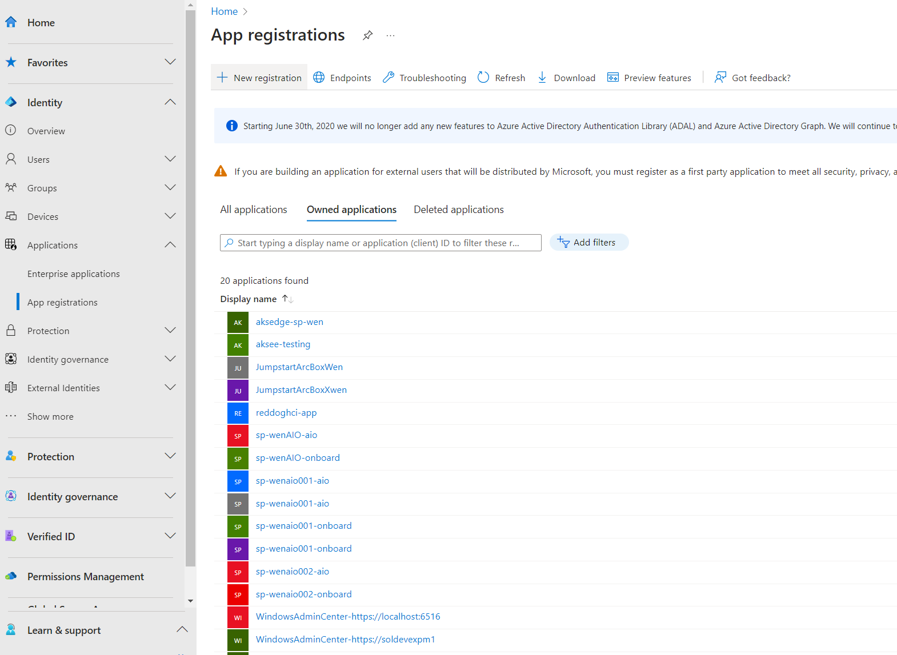

Add **Federated credential** to the service principal.

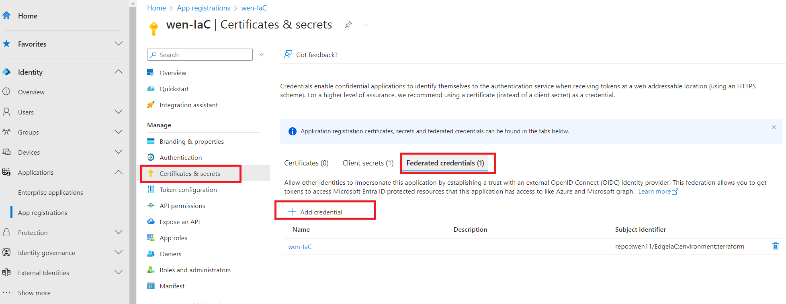

Select `Environment` as entity type and input `terraform` to `Based on selection` input box

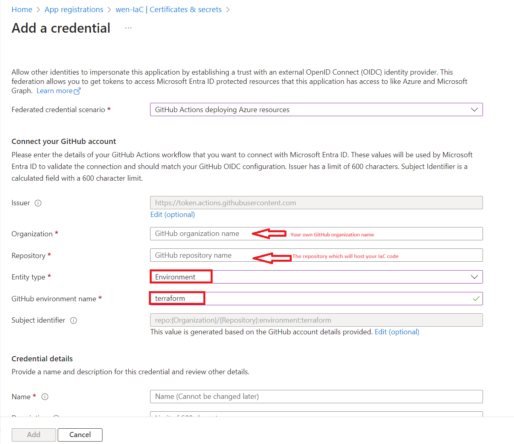

Repeat above steps to create another federation credential and Select `Pull Request` as entity type

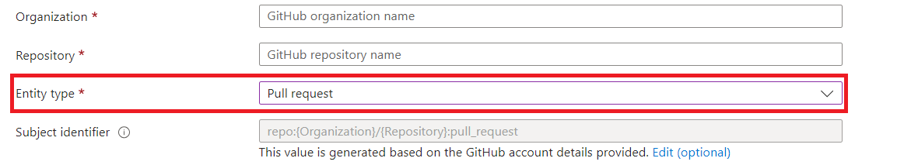

Add a **secret** into the service principal, then, save it to `servicePrincipalSecret`. We will need it in your IaC repository.

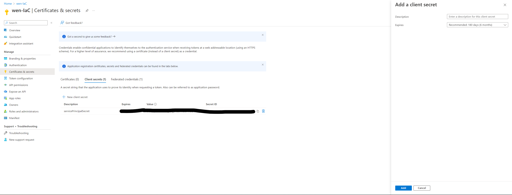

## Grant permissions for the service principal

Grant the following permissions

- Contributor (to create resource group / KeyVault / HCI cluster...)
- Key Vault Secrets Officer (to create secret in Azure KeyVault)
- User Access Administrator (to grant role for Arc-enabled servers)

Go back to your Azure subscription page in Azure portal, select **IAM** -> **Add Role Assignment**, then grant the permissions as follows

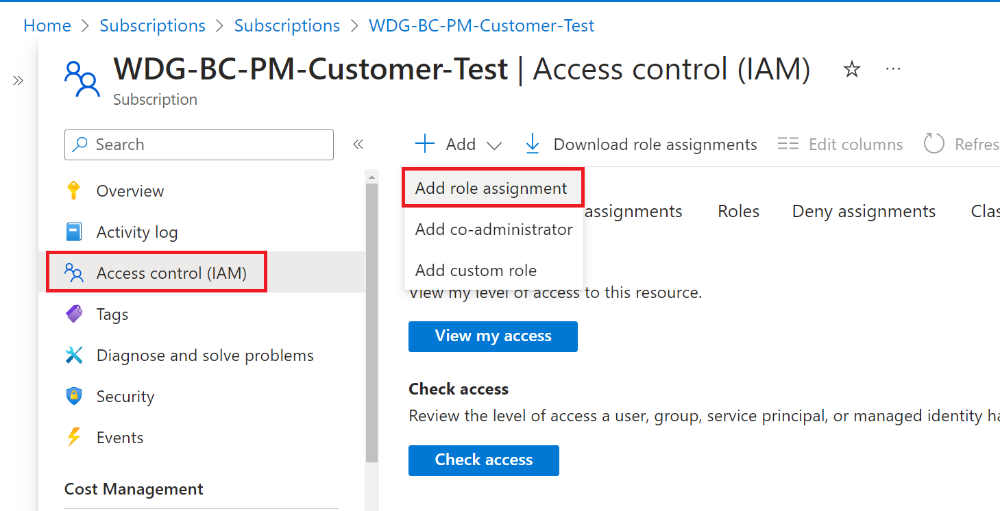

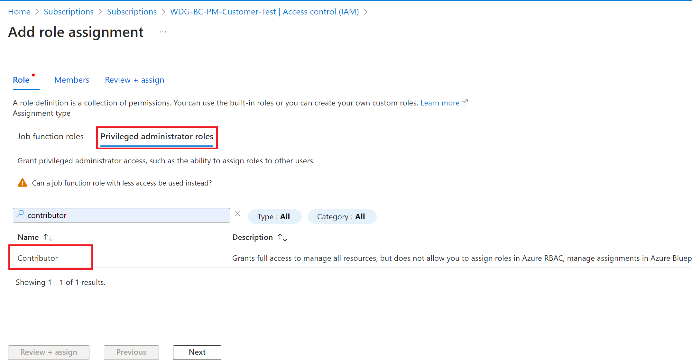

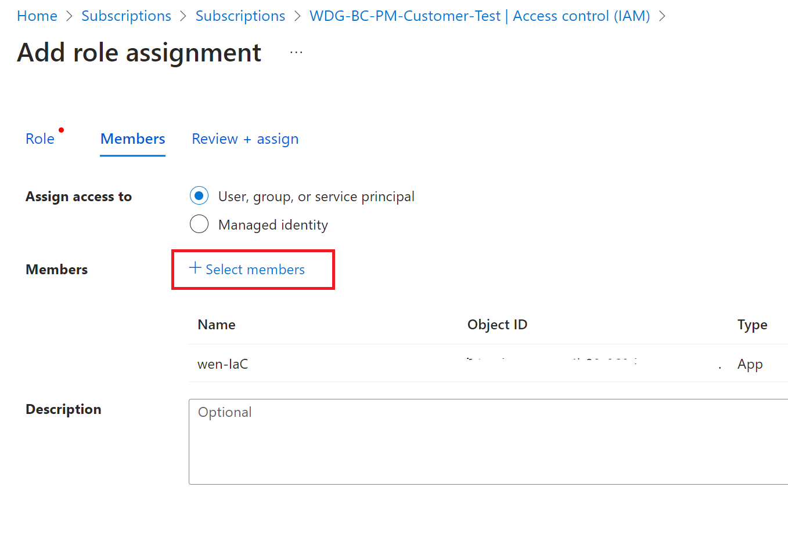

## Setup GitHub repo secrets

Go to your GitHub repository, click repository **Settings** , then go to **Secrets and variables**, select **Actions** to create **New repository secret**

Set up the following secrets：

1. Pipeline secrets:

    - AZURE_CLIENT_ID: The client ID of the service principal in step 1.
    - AZURE_SUBSCRIPTION_ID: The subscription ID of the service principal in step 1.
    - AZURE_TENANT_ID: The tenant ID of the service principal in step 1.

2. HCI secrets:

    - domainAdminUser: The admin user name of domain controller. (Leave it empty if you prepare AD yourself)
    - domainAdminPassword: The admin user password of domain controller. (Leave it empty if you prepare AD yourself)
    - localAdminUser: The admin user name of HCI hosts.
    - localAdminPassword: The admin user password of HCI hosts.
    - deploymentUserPassword: The password of deployment user which will be created during HCI deployment.
    - servicePrincipalId: The **client** ID of the service principal for Arc Resource Bridge deployment. (Can be the same as AZURE_CLIENT_ID)
    - servicePrincipalSecret: The client secret of the service principal for Arc Resource Bridge deployment.
    - rpServicePrincipalObjectId (Check [Getting rpServicePrincipalObjectId](#getting-rpserviceprincipalobjectid) to get its value.)

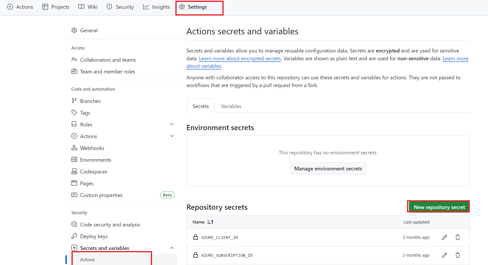

## Getting rpServicePrincipalObjectId

### Use UI
Go to [Microsoft Entra Admin Center](https://entra.microsoft.com/#home). Go to Identity -> Applications -> Enterprise applications. Remove the Application type filter.

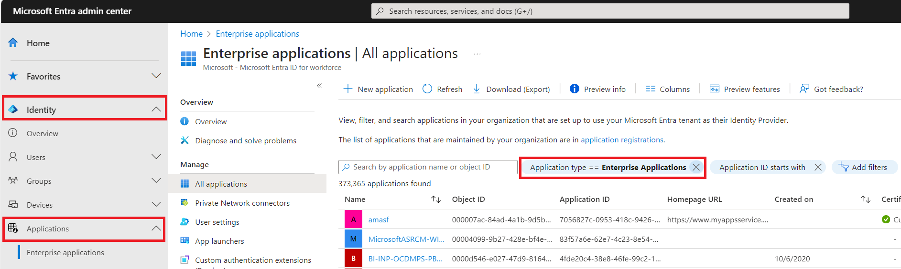

Then, click the Application ID starts with filter. Input `1412d89f-b8a8-4111-b4fd-e82905cbd85d` and apply.

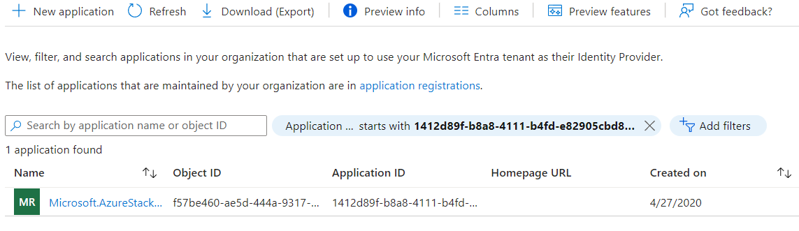

Click `Microsoft.AzureStackHCI Resource Provider`. Copy its Object ID, this value needs to be set to repository secret `rpServicePrincipalObjectId`.

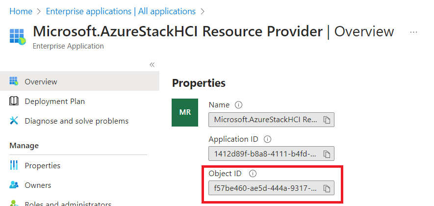

### Use Az CLI

Run `az ad sp list --filter "appid eq '1412d89f-b8a8-4111-b4fd-e82905cbd85d'"`. Copy the value in `id` field.

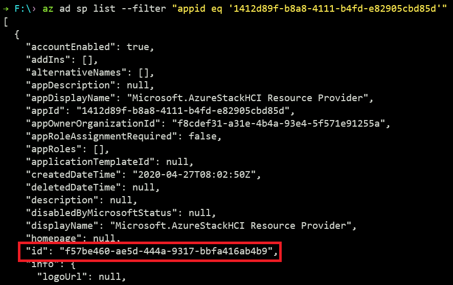

---
Next Step: [Configure Local Git](./Configure-Local-Git.md)