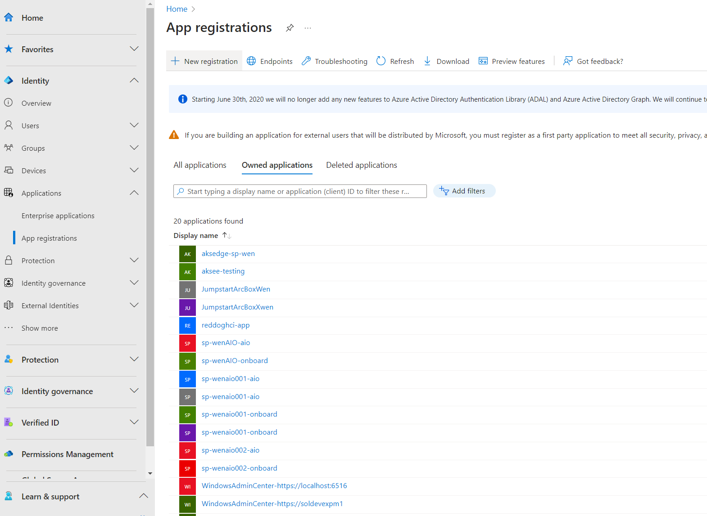
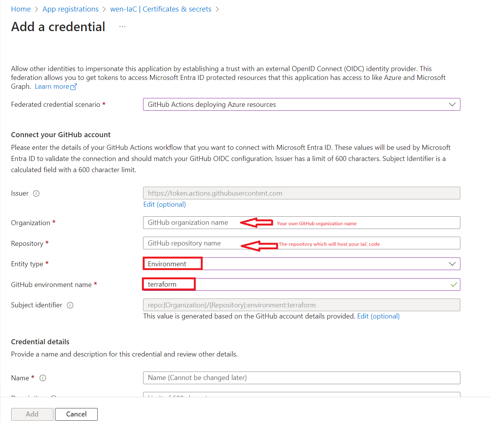
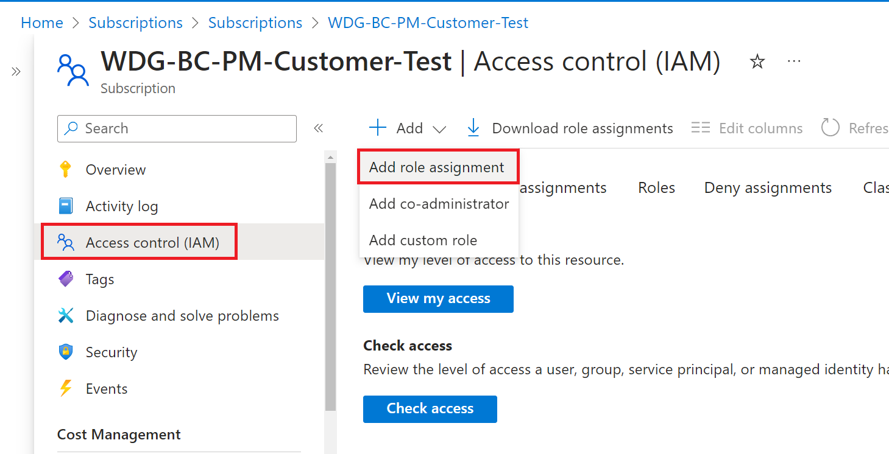
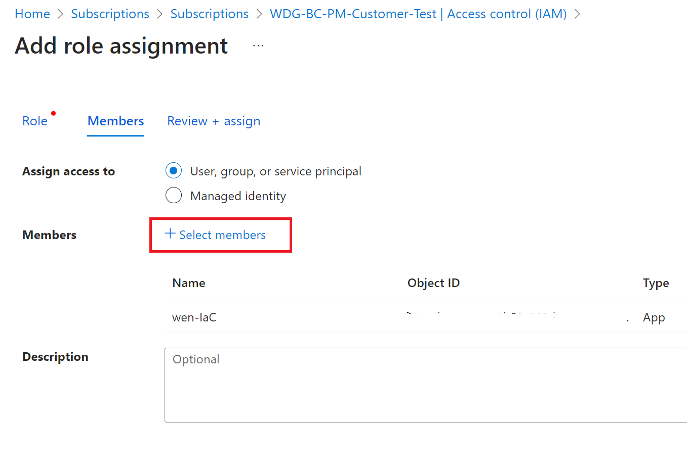

# Getting Started
## Prerequisites

Before you get started, here are the steps you need to perform for prerequisites:

- Check deployment checklist and install AzureStack HCI OS on your servers to be deployed as AzureStack HCI clusters
- Complete the step 2 (Download the software) & 3 (Install the OS) in this [doc](https://learn.microsoft.com/en-us/azure-stack/hci/deploy/download-azure-stack-hci-23h2-software).

<mark>Step 1 (Prepare Active Directory) & 4 (Register with Arc and set up permissions) are covered in the project.</mark>

## Getting Started

### Create a repository based on this template


### Connect GitHub Actions and Azure

1.**Setup [OIDC service principle](https://docs.github.com/en/actions/deployment/security-hardening-your-deployments/configuring-openid-connect-in-azure)**

&nbsp; &nbsp; &nbsp; &nbsp; Create `terraform` environment in your GitHub repository


Go to [Microsoft Entra Admin Center](https://entra.microsoft.com/#home) to create a service principal. Click **Applications** in the menu bar and then click **App Registrations** to list all the available service princpals. Create a new one for IaC



Add **Federated credential** to the service principal.


Select `Environment` as entity type and input `terraform` to `Based on selection` input box



Add a **secret** into the service principal, then, save it to `servicePrincipalSecret`. We will need it in your IaC repository.


2.**Grant permissions for the service principal**

&nbsp; &nbsp; &nbsp; &nbsp;  grant the following permissions
      - Contributor (to create resource group / KeyVault / HCI cluster...)
      - Key Vault Secrets Officer (to create secret in azure KeyVault)
      - User Access Administrator (to grant role for arc-enabled servers)

&nbsp; &nbsp; &nbsp; &nbsp; Go back to your Azure subscription page in Azure portal, select **IAM** -> **Add Role Assignment**, then grant the permissions as follows






3.**Setup GitHub repo secrets**

&nbsp; &nbsp; &nbsp; &nbsp; Go to your GitHub repository, click repository **Settings** , then go to **Secrets and variables**, select **Actions** to create **New repository secret**


Set up the following secrets：

1. Pipeline secrets:

    - AZURE_CLIENT_ID: The client ID of the service principle in step 1.
    - AZURE_SUBSCRIPTION_ID: The subscription ID of the service principle in step 1.
    - AZURE_TENANT_ID: The tenant ID of the service principle in step 1.

2. HCI secrets:

    - domainAdminUser: create a new user name
    - domainAdminPassword: create new password
    - localAdminUser: username when you login to the local host
    - localAdminPassword: password you use to login into the local host
    - deploymentUserName
    - deploymentUserPassword
    - servicePrincipalId
    - servicePrincipalSecret

### Setup Terraform backend

Create a storage account in your Azure subscription (the same subscription as AZURE_SUBSCRIPTION_ID). Create a container in it.


Open `.azure/backendTemplate.tf` in this repository. Replace `\<ResourceGroupName\>`, `\<StorageAccountName\>`, `\<StorageContainerName\>` to the storage account and container you just created. <br/>

Commit `.azure/backendTemplate.tf` by running `git commit` and the run `git push` to push the changes to the remote branch.

### Setup git hooks

    Run `git config --local core.hooksPath ./.azure/hooks/`.
    This hook will generate the pipeline definition `deploy-infra.yml` when you commit changes to this repository.

### Setup GitHub runners

    - If the remote PowerShell port(5985) of HCI is exposed to the Internet. Open `.github/workflows/site-cd-workflow.yml`. Modify `runs-on` section to
    ```yml
        runs-on: [ubuntu-latest]
        # runs-on: [self-hosted]
    ```
    - If your HCI nodes can be remote managed inside your CorpNet. You can [setup self-host runner](https://docs.github.com/en/actions/hosting-your-own-runners/managing-self-hosted-runners/adding-self-hosted-runners). Runner hosts must setup the following tools.
        1. Install [Git](https://git-scm.com/downloads). Add `Git` to path. Run `git --version` to validate.
        2. Add `<Git installation root>\usr\bin` to path. The default path is `C:\Program Files\Git\usr\bin`. 
        3. Install [Az CLI](https://learn.microsoft.com/en-us/cli/azure/install-azure-cli). Run `az --version` to validate installation.
        4. Follow the first answer in [PowerShell Remoting - stackoverflow](https://stackoverflow.com/questions/18113651/powershell-remoting-policy-does-not-allow-the-delegation-of-user-credentials), finish client side settings to allow remote PowerShell HCI servers from runners.
        5. [Register self-hosted runners](https://docs.github.com/en/actions/hosting-your-own-runners/managing-self-hosted-runners/adding-self-hosted-runners). Make sure that the runner process is running as Administrator.

### Setup Repository

1. Create a branch from `main`.
1. Rename `dev/sample` to `<your location>`. Edit the variables in the `dev/<your location>/main.tf` commit and push.
1. Create a pull request to `main`. After approval, changes will be applied automatically. After the successful deployment, following resources will be created:
    1. A resource group name `<site>-rg`
    1. A KeyVault named `<site>-kv`: Contains secrets that used for deploy
    1. Arc servers that make up the HCI cluster
    1. A storage account used for HCI cloud witness
    1. An HCI cluster name `<site>-cl`
    1. Arc Resource Bridge named `<site>-cl-arcbridge`
    1. Custom location of ARB named `<site>-customLocation`
    1. Two storage paths named `UserStorage1`, `UserStorage2`
1. Add new sites by copy and paste your first site folder to others. Commit and create a pull request for new sites. After the pull request is merged, new sites will be applied.

## Sample scenario: Add new sites

After the first HCI deployment succeeds, you may want to scale the deployment to more sites. You can simply copy and paste your first site folder. Edit `main.tf` for each newly copied sites to the site specific values. Commit and create a pull request for the changes. Deployment pipeline and backend settings will be set during the commit. Once the pull request is merged into `main` branch, pipeline will be triggered and deploy new sites accordingly. An example could be

```├───dev
│   └───firstsite
│           main.tf
│           ...
│
├───prod
│   ├───prod1
│   │       main.tf
│   │       ...
│   │
│   ├───prod2
│   │       main.tf
│   │       ...
│   │
│   └───prod3
│           main.tf
│           ...
│
└───qa
    ├───qa1
    │       main.tf
    │       ...
    │
    └───qa2
            main.tf
            ...
```