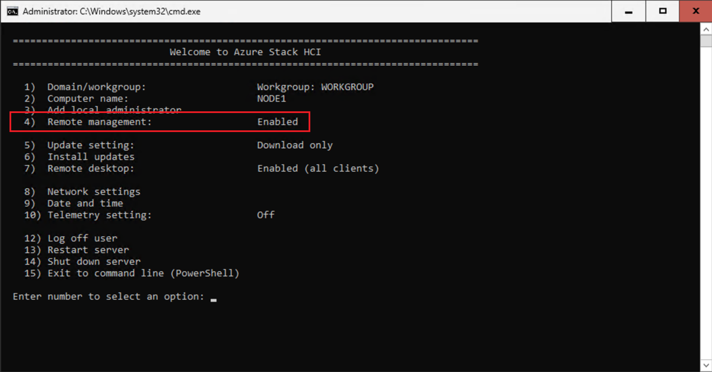
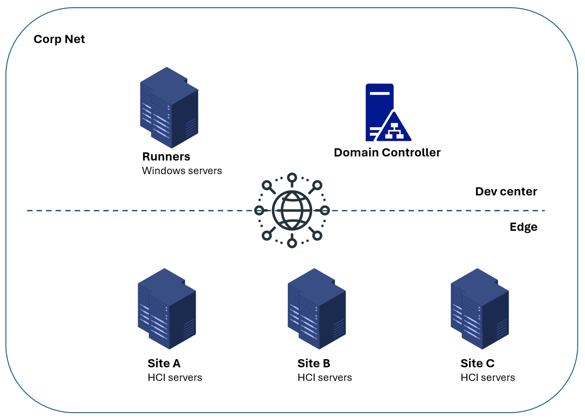

# Getting Started

## Prerequisites

Before you get started, here are the steps you need to perform for prerequisites:

- Check deployment checklist and install AzureStack HCI OS on your servers to be deployed as AzureStack HCI clusters
- Complete the step 2 (Download the software) & 3 (Install the OS) in this [doc](https://learn.microsoft.com/en-us/azure-stack/hci/deploy/download-azure-stack-hci-23h2-software).
- **Make sure `Remote management` section is `Enabled`.**

<mark>Step 1 (Prepare Active Directory) & 4 (Register with Arc and set up permissions) are covered in the project.</mark>

## Overview

The QuickStart solution uses remote PowerShell to complete the Active Directory preparation and Arc registration. The following picture shows an overview of a basic hardware setup.

In dev center, there are Windows servers act as GitHub runners and Active Directory Domain Controllers. On edge, servers are installed with HCI OS. All the servers are connected to the Corp net. Servers on edge allows remote management inside the Corp net. No inbound is allowed from the Internet.

With this hardware setup, system admins can provision HCI clusters at scale by GitHub Actions.

## Setup

1. [Create a repository based on this template](./Create-Repository.md)
2. [Connect GitHub Actions and Azure](./Connect-Azure.md)
3. [Configure Local Git](./Configure-Local-Git.md)
4. [Setup Terraform Backend](./Setup-Terraform-Backend.md)
5. Set up GitHub Runners
   1. If you have internet accessible servers, [Use GitHub Hosted Runners](./Use-GitHub-Hosted-Runners.md)
   2. If you have corpnet network accessible servers,
      * If you want to use automations in this repository to onboard Arc servers and prepare AD, then [Setup Self Hosted Runners](./Setup-Self-Hosted-Runners.md)
      * If servers in all sites are connected to Arc by yourself, then [Use GitHub Hosted Runners](./Use-GitHub-Hosted-Runners.md)

## Next Step

[Go back to home page](../README.md)

Learn more:

- About [adding your first site with static templates](./Add-first-Site.md)
- About [your CI/CD pipeline running status](./View-pipeline.md)
- About [troubleshooting](./TroubleShooting.md)
- About [adding new sites with the customized templates](../README.md#scenario-2-convert-your-poc-site-settings-into-iac-code-then-scale-private-preview)
- About [enabling arc extensions for all sites](../README.md#enable-arc-extensions-for-all-sites)