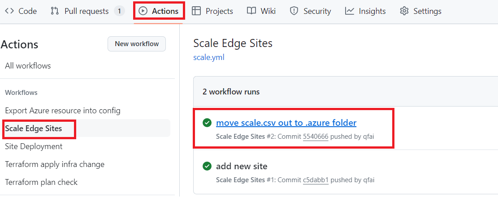
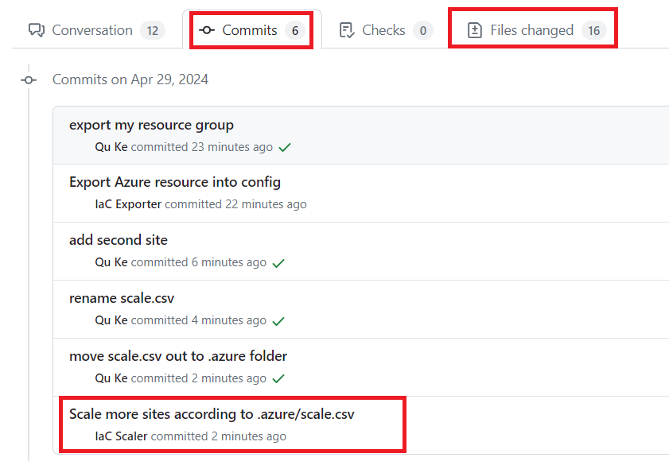

# methodology
The scale workflow will run every time you push `./.azure/scale.csv` into a non-main branch; the workflow will generating terraform codes according to the csv file and then delete the csv file.

In the csv file, each column represents a parameter required for customer input, the first row is parameters from the sample site, each other row represents a site that needs to be scaled.

If you convert your PoC site settings into IaC code, then the sample csv file can be found in `./.azure/scale/<yourModuleName>.csv`, You can resave the file to `./.azure/scale.csv`.

If you scale by static template, you need to run `./az-edge-site-scale generate -c ./.azure/scale.csv -s ./dev/<yourSiteName>` to get the scaling csv file. You can find a spreadsheet under `./.azure`. The spreadsheet contains all the entries which need customized inputs from you per site.

# Scale with automations

1. Make sure your are in <yourFeatureBranch> by running `git branch`. If not, `git checkout -b <yourFeatureBranch>`.
2. You can find a spread sheet under `./.azure`. The spread sheet contains all the entries which need customized inputs from you per site.
3. Open the scale.csv file by Excel. Input new values according to the first line.
4. Commit `git commit -m <commit message>`and then push the CSV `git push -u origin <yourFeatureBranch>` to the remote feature branch. The pre-commit hook will add new sites to the deployment workflow automatically.
5. After pushing to the remote branch, new scaling configurations in Terraform format will be automatically generated through our automation workflow. Create a pull request to `main`. You can view the workflow execution in action panel.

6. After the workflow execution finished, you can check the files changed by the automation workflow. If all jobs complete successfully, you can merge the branch to `main`.

## Next Step

[Go back to home page](../README.md)

Learn more:

* About [your CI/CD pipeline running status](./View-pipeline.md)
* About [troubleshooting](./TroubleShooting.md)
* About [enabling arc extensions for all sites](../README.md#enable-arc-extensions-for-all-sites)
* About [adding new stage](./Customize-Stages.md)