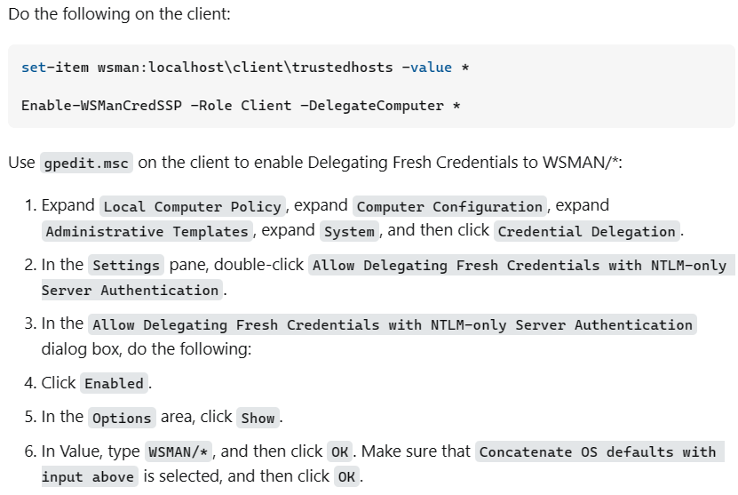
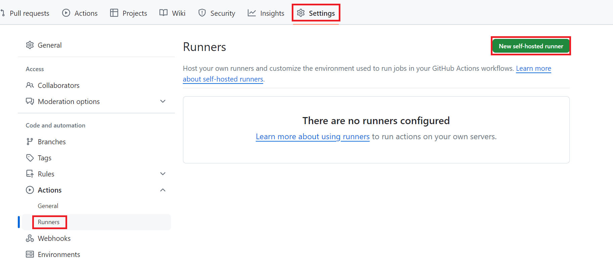

# Setup Self Hosted runners

1. Prepare a Windows machine.
2. Install [Git](https://git-scm.com/downloads). Add `Git` to path. Run `git --version` to validate.
3. Add `<Git installation root>\usr\bin` to **system** path. The default path is `C:\Program Files\Git\usr\bin`. 
4. Install [Az CLI](https://learn.microsoft.com/en-us/cli/azure/install-azure-cli). Run `az --version` to validate installation.
5. Follow the first answer in [PowerShell Remoting - StackOverflow](https://stackoverflow.com/questions/18113651/powershell-remoting-policy-does-not-allow-the-delegation-of-user-credentials), finish client side settings to allow remote PowerShell HCI servers from runners.

6. [Register self-hosted runners](https://docs.github.com/en/actions/hosting-your-own-runners/managing-self-hosted-runners/adding-self-hosted-runners). Make sure that the runner process is running as Administrator. **Shorten the work folder of your runner as much as possible to avoid Windows path length limit.** E.g., `C:\_r\_w`

---
Next Step: Continue on [Add-first-site](./Add-first-Site.md)
