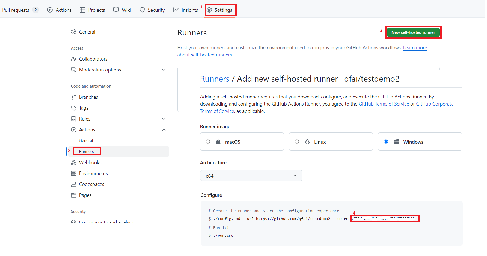

# Setup Self Hosted runners

1. Prepare a Windows machine.
2. [Download](https://github.com/Azure/Edge-infrastructure-quickstart-template/releases/download/v0.0.1/self-hosted-runner.ps1) the automation script
3. Get the runner key
   1. if you do this with Connect Azure script, Press enter will give you the whole command for step 4
   2. if you want to do this with gh powershell command
   ```
   gh api --method POST -H "Accept: application/vnd.github+json" "/repos/<YourRepositoryOwner>/<YourRepositoryName>/actions/runners/registration-token" | ConvertFrom-Json | Select-Object -ExpandProperty token
   ```
   3. if you want to do this with GitHub UI
    
4. Run the script in runner machine
```
./self-hosted-runner.ps1 -gitHubRepoNameWithOwner <YourRepositoryOwner>/<YourRepositoryName>  -runnerToken <step3Token> 
```

---
Next Step: Continue on [Add-first-site](./Add-first-Site.md)
