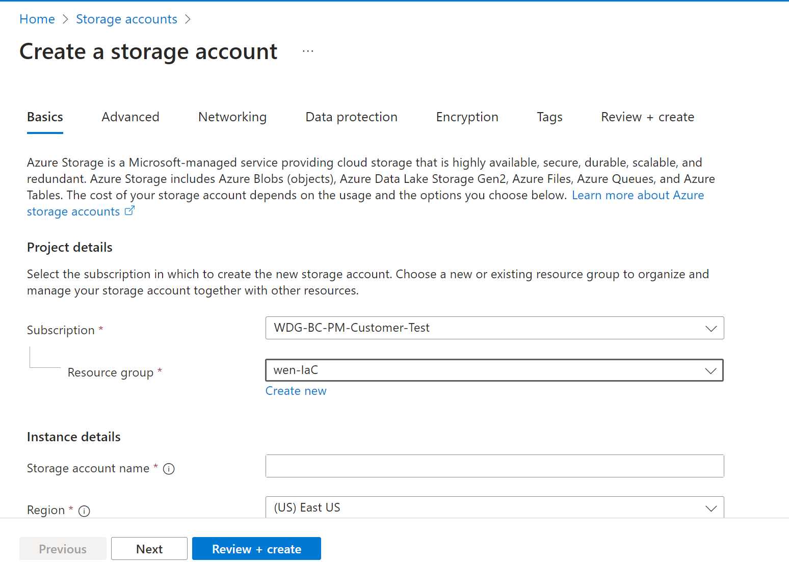
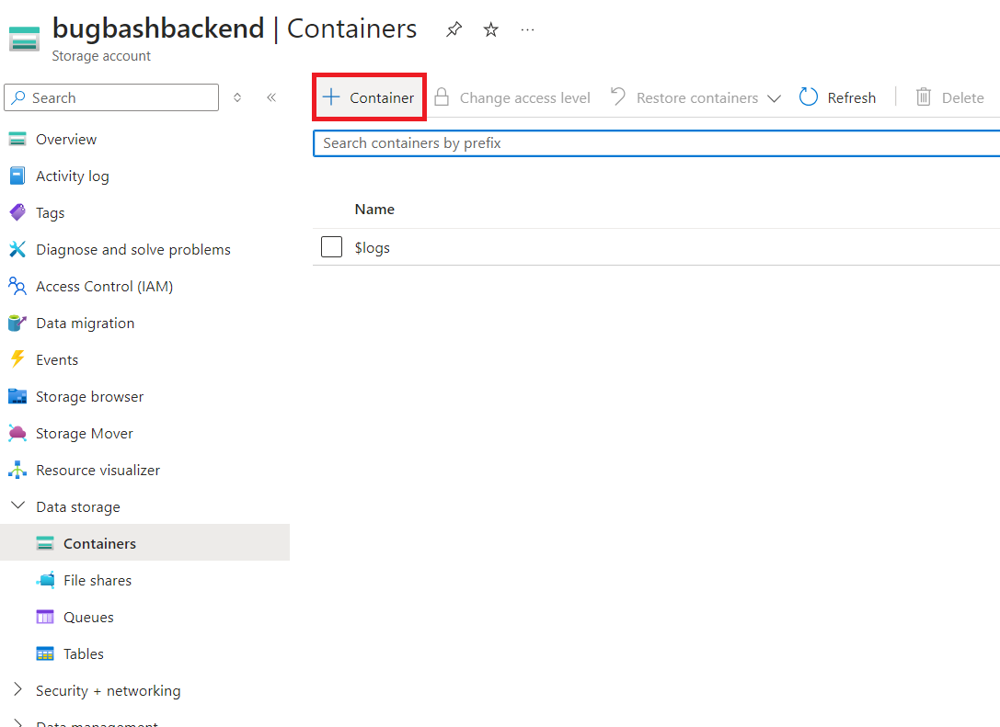

# Setup Terraform backend

Create a storage account in your Azure subscription (the same subscription as AZURE_SUBSCRIPTION_ID).

and create a container in it.

Open `.azure/backendTemplate.tf` in this repository. Replace `\<ResourceGroupName\>`, `\<StorageAccountName\>`, `\<StorageContainerName\>` to the storage account and container you just created.  

Commit `.azure/backendTemplate.tf` by running `git commit` and the run `git push` to push the changes to the remote branch.

---
If your servers are exposed to Corpnet only, Next Step: [Setup Self Hosted Runners](./Setup-Self-Hosted-Runners.md)

If your servers are exposed to Internet or you already have arc connected server: Next Step: [Use GitHub Hosted Runners](./Use-GitHub-Hosted-Runners.md)