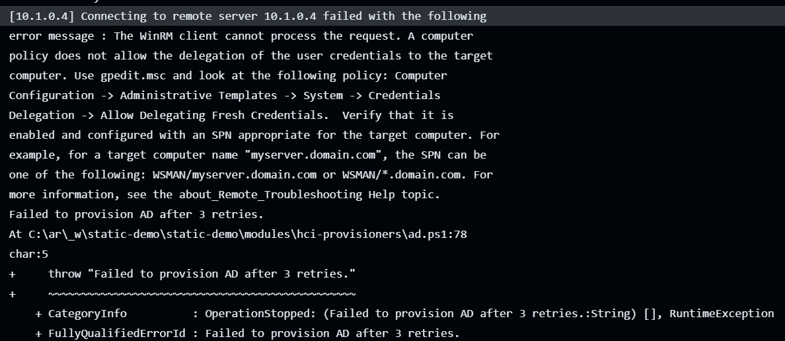

# Trouble Shooting

## Cannot download az-edge-site-scale

The problem is the SAS token repo secret is not being set or incorrect.

Solution: Add `PRIVATE_PREVIEW_SAS` to your GitHub repo secrets.

## Fail to run Terrafrom Apply

In this case, terraform has send rest API to arm but got failure, the first thing to do is to identify which resource is failed. We can determine which resource failed from the portion enclosed in the red box in the image, in this snapshot, it is deploymentSetting resource.

## deploymentSetting resource failed

If the resource is azapi_update_resource_deploymentsetting, then this is because the deployment of HCI cluster is failed.

If the resource is azapi_resource.validatedeploymentsetting or azapi_resource.validatedeploymentsetting_seperate, then this is because the validation of HCI cluster is failed.

The log in the action have error message, you can troubleshooting according to [HCI's guide](https://learn.microsoft.com/en-us/azure-stack/hci/manage/get-support)

## ad_creation_provisioner resource failed

This is because the preparation of self host runner is not ready, see [self-host runner](./Setup-Self-Hosted-Runners.md), ensure the Allow Delegating Fresh Credentials with NTLM-only Server Authentication is enabled as stated. Then, rerun the failed job.

## Further Support

For problem that not include in this file, you can [open issue](https://github.com/Azure/Edge-infrastructure-quickstart-template/issues/new) in Azure
/
Edge-infrastructure-quickstart-template repository
