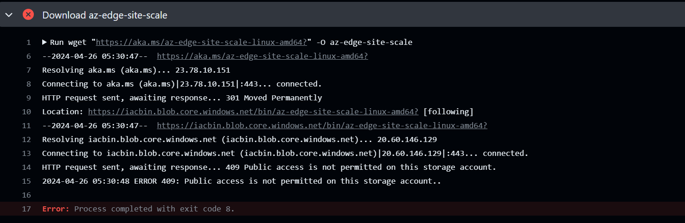
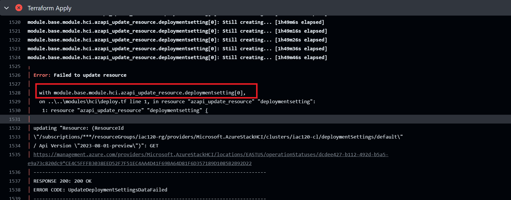

# Scale Workflow error

## Download az-edge-site-scale step failed

The problem is the sas token repo secret is not being set or incorrect.

Solution:
1. Add `PRIVATE_PREVIEW_SAS` to your GitHub repo secrets.

# Deploy Infra workflow failure

## Terraform apply step failed

In this case, terraform has send rest api to arm but got failure, the first thing to do is to identify which resource is failed. We can determine which resource failed from the portion enclosed in the red box in the image, in this snapshot, it is deploymentsetting resource.

### deploymentsetting resource failed
If the resource is azapi_update_resource_deploymentsetting, then this is because the deployment of HCI cluster is failed.

If the resource is azapi_resource.validatedeploymentsetting or azapi_resource.validatedeploymentsetting_seperate, then this is because the validation of hci cluster is failed.

The log in the action have error message, you can troubleshooting according to [HCI's guide](https://learn.microsoft.com/en-us/azure-stack/hci/manage/get-support)

# Contact
For problem that not include in this file, you can [open issue](https://github.com/Azure/Edge-infrastructure-quickstart-template/issues/new) in Azure
/
Edge-infrastructure-quickstart-template repository
