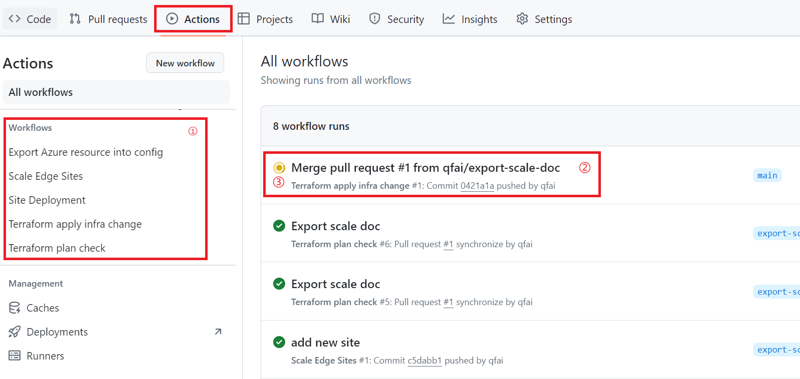

You can view workflow status through actions page

the left panel ① show all workflows, you can click to filter by workflows. The panel ② shows which commit the workflow run on and the ③ shows workflow running status

You can click the ② to get detailed information about its steps and step logs.

Following is the detailed introduction of each workflow

- Export Azure resource into config: is used in export functionality
- Scale Edge Sites is used in scale
- Site Deployment: is a sub workflow, it referenced by terraform apply infra change workflow. The workflow is mainly run terraform related commands like terraform plan, terraform apply.
- Terraform apply infra change: is the main CI/CD workflow that deploy your infra change in a stage manner, it will be triggered when every push is made against main branch.
- Terraform plan check: is helper workflow that will be triggered every time you made a pull request to main branch, it will generate a terraform plan report based on your pull request change, a example is showed in following picture.

